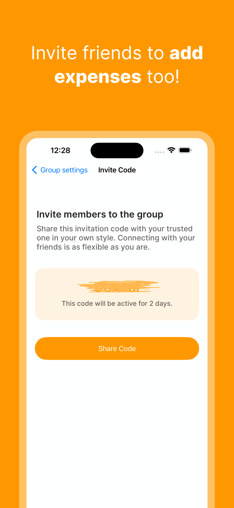
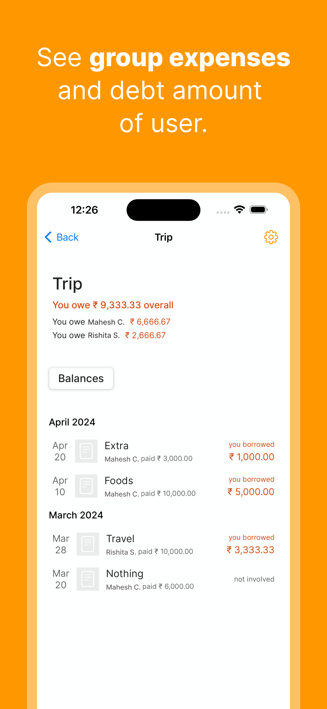
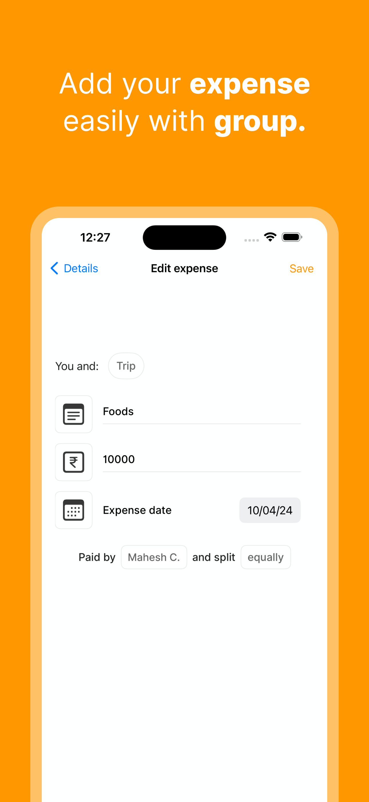
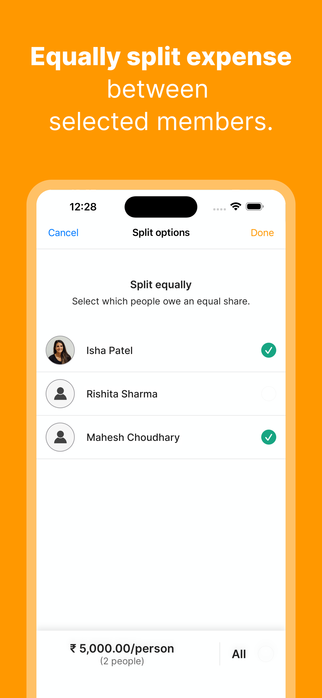

<p align="center"> <a href="https://canopas.com/contact"> </a></p>

# Splito - Divide, Conquer, Enjoy Together! 💰
Simplifying group expense management easy and fair among friends and family with advanced tracking and splitting features.

## Overview
Splito is an open-source expense tracking and splitting application inspired by Splitwise. It simplifies the management of shared expenses, making it easy for users to track and split costs among friends, family, or group members. Whether for a group trip, shared household bills, or any other collective expense, Splito ensures fairness and transparency in cost-sharing with its user-friendly interface and robust features.

## Download App
</img>

## Screenshots
<table>
  <tr>
    <th width="32%"> Group List </th>
    <th width="32%"> Invite Friends/Group Members </th>
    <th width="32%"> Group Expense List </th>
  </tr>
  <tr>
    <td>  </td>
    <td>  </td>
    <td>  </td>
  </tr>  
</table>
<table>
  <tr>
    <th width="32%"> Group Balance </th>
    <th width="32%"> Expense Edit </th>
    <th width="32%"> Expense Split Option </th>
  </tr>
  <tr>
    <td>  </td>
    <td>  </td>
    <td>  </td>
  </tr>  
</table>

## Features
- **Group Management:** Create and manage multiple expense groups for different purposes (e.g., games, trips, shared bills).
- **Expense Tracking:** Add expenses with details such as description, amount, payer, and date.
- **Expense Splitting:** Split expenses equally or based on customizable ratios among group members.

<details>
  <summary> How to Use Splito </summary>

  ## How to Use Splito
  
- Create a Group:
  - Start by creating a new expense group for your specific need (e.g., a trip to Goa, monthly utilities).
- Add Members:
  - Invite friends, family, or colleagues to join the group.
- Track Expenses:
  - Add expenses as they occur, detailing the amount, who paid, and any relevant notes.
- Split Costs:
  - Use its flexible splitting options to divide expenses fairly among the group members.

</details>

## Requirements
Make sure you have the latest stable version of Xcode installed. You can then proceed by cloning this repository to Xcode.

To run Splito locally, you'll need:
- iOS (version 16.4 or higher)
- Xcode (version 15.4 or higher)

<details>
  <summary> Firebase Setup </summary>

## Firebase Setup

To enable Firebase services, you will need to create a new project in the Firebase Console. Use the app bundle ID value specified in the project setting in Xcode. Once the project is created, you will need to add the GoogleService-Info.plist file to the project. For more information, refer to the [Firebase documentation](https://firebase.google.com/docs/ios/setup).

Splito uses the following Firebase services, Make sure you enable them in your Firebase project:

- Authentication (Phone, Google and Apple login)
- Firestore (To store user data)

</details>

## Tech stack
Splito utilizes the latest iOS technologies and adheres to industry best practices. Below is the current tech stack used in the development process:
- MVVM Architecture
- SwiftUI
- Combine + Swift
- Firebase Datastore
- Swinject for DI
- SwiftLint for Lint
- CocoaLumberjack for Logging

## Contribution
Splito is an open-source project but currently, we are not accepting any contributions.

## Credits
Splito is owned and maintained by the [Canopas team](https://canopas.com/). You can follow them on Twitter at [@canopassoftware](https://twitter.com/canopassoftware) for project updates and releases. If you are interested in building apps or designing products, please let us know. We'd love to hear from you!

<a href="https://canopas.com/contact"></a>

## License

**Splito** is licensed under the Apache License, Version 2.0.

```
Copyright 2024 Canopas Software LLP

Licensed under the Apache License, Version 2.0 (the "License");
You won't be using this file except in compliance with the License.
You may obtain a copy of the License at

   http://www.apache.org/licenses/LICENSE-2.0

Unless required by applicable law or agreed to in writing, software
distributed under the License is distributed on an "AS IS" BASIS,
WITHOUT WARRANTIES OR CONDITIONS OF ANY KIND, either express or implied.
See the License for the specific language governing permissions and
limitations under the License.
```
