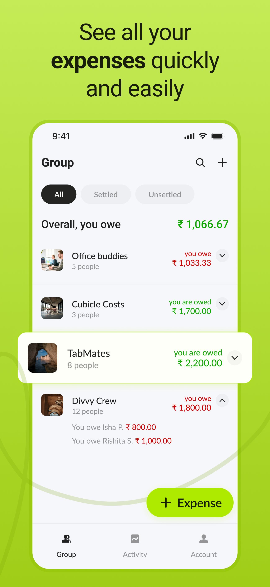
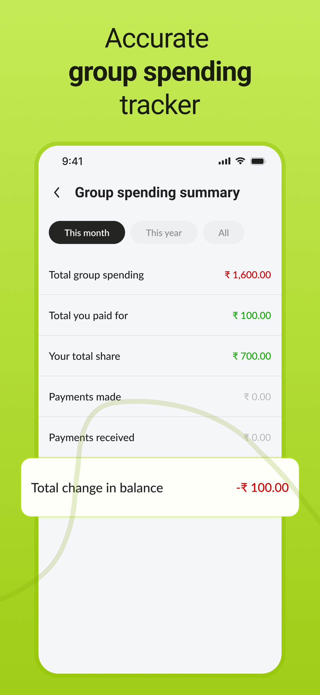
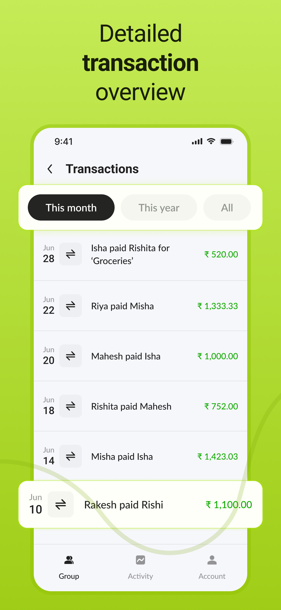

<a href="https://canopas.com/contact"> </a>

# Splito - Divide, Conquer & Enjoy Together! 💰
Simplifying group expense management is easy and fair among friends and family with advanced tracking, splitting, and settlement features.


## Overview

Splito is an open-source expense tracking and splitting application inspired by Splitwise. It simplifies the management of shared expenses💰, making it easy for users to track📈, split, and settle costs among friends, family, or group members👫.

Whether it's a group trip🌍, shared household bills🏠, or any other collective expense, Splito ensures fairness and transparency in cost-sharing with its user-friendly interface and robust features. Users can effortlessly manage debts and settle up💳 payments within their groups👥.

## Download App 
<a href="https://apps.apple.com/in/app/splito-split-enjoy-together/id6477442217"> </img> </a>

## Features🌟

Splito is currently in active development 🚧, with plans to incorporate additional features shortly.

- **Group Management:** Create and manage multiple expense groups👥 for different purposes (e.g., games, trips, shared bills).
- **Expense Tracking:** Add expenses💰 with details such as description, amount, payer, and date.
- **Expense Splitting:** Split expenses equally⚖️ or based on customizable ratios among group members.
- **Payment Settlement:** Easily settle up💳 the payments with other members of the group to clear outstanding balances.

<details>
  <summary> How to Use Splito </summary>

  ## How to Use Splito
  
- Create a Group➕:
  - Start by creating a new expense group for your specific need (e.g., a trip to Goa, monthly utilities).
- Add Members👥:
  - Invite friends, family, or colleagues to join the group.
- Track Expenses📈:
  - Add expenses as they occur, detailing the amount, who paid, and any relevant notes.
- Split Costs⚖️:
  - It uses flexible splitting options to divide expenses fairly among group members.
- Payment Settlements💳:
  - Settle up the payment with any other group member as any payment occurs.

</details>

## Screenshots
<table>
  <tr>
    <th width="32%"> Group List </th>
    <th width="32%"> Group Expense List </th>
    <th width="32%"> Invite Friends/Group Members </th>
  </tr>
  <tr>
    <td>  </td>
    <td>  </td>
    <td>  </td>
  </tr>  
</table>
<table>
  <tr>
    <th width="32%"> Expense Edit </th>
    <th width="32%"> Expense Split Option </th>
    <th width="32%"> Group Payments </th>
  </tr>
  <tr>
    <td>  </td>
    <td>  </td>
    <td>  </td>
  </tr>  
</table>
<table>
  <tr>
    <th width="32%"> Group Balance </th>
    <th width="32%"> Group Total Summary </th>
    <th width="32%"> Transactions </th>
  </tr>
  <tr>
    <td>  </td>
    <td>  </td>
    <td>  </td>
  </tr>  
</table>

## Requirements✅
Make sure you have the latest stable version of Xcode installed. You can then go ahead with cloning this repository to Xcode.

To run Splito locally, you'll need:
- iOS (version 16.4 or higher)
- Xcode (version 15.4 or higher)

<details>
  <summary> Firebase Setup </summary>

## Firebase Setup🚀

To enable Firebase services, you will need to create a new project in the Firebase Console. Use the app bundle ID value specified in the project setting in Xcode. Once the project is created, you will need to add the GoogleService-Info.plist file to the project. For more information, refer to the [Firebase documentation](https://firebase.google.com/docs/ios/setup).

Splito uses the following Firebase services, Make sure you enable them in your Firebase project:

- Authentication (Phone, Google and Apple login)
- Firestore (To store user data)

</details>

## Tech stack📚
Splito utilizes the latest iOS technologies and adheres to industry best practices. Below is the current tech stack used in the development process:
- MVVM Architecture
- SwiftUI
- Concurrency
- Combine + Swift
- Swinject for DI
- SwiftLint for Lint
- Cloud Functions
- Firebase Firestore
- Firebase Authentication
- CocoaLumberjack for Logging

## Contribution🤝
Splito is an open-source project but currently, we are not accepting any contributions.

## Credits
Splito is owned and maintained by the [Canopas team](https://canopas.com/). You can follow them on Twitter at [@canopassoftware](https://twitter.com/canopassoftware) for project updates and releases. If you are interested in building apps or designing products, please let us know. We'd love to hear from you!

<a href="https://canopas.com/contact"></a>

## License📄

**Splito** is licensed under the Apache License, Version 2.0.

```
Copyright 2024 Canopas Software LLP

Licensed under the Apache License, Version 2.0 (the "License");
You won't be using this file except in compliance with the License.
You may obtain a copy of the License at

   http://www.apache.org/licenses/LICENSE-2.0

Unless required by applicable law or agreed to in writing, software
distributed under the License is distributed on an "AS IS" BASIS,
WITHOUT WARRANTIES OR CONDITIONS OF ANY KIND, either express or implied.
See the License for the specific language governing permissions and
limitations under the License.
```
