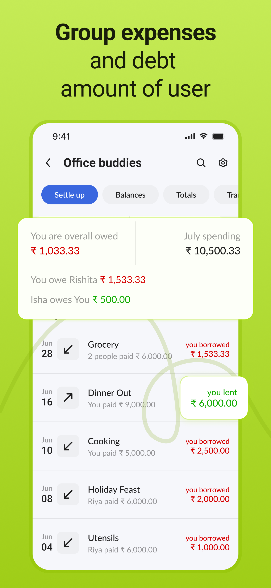
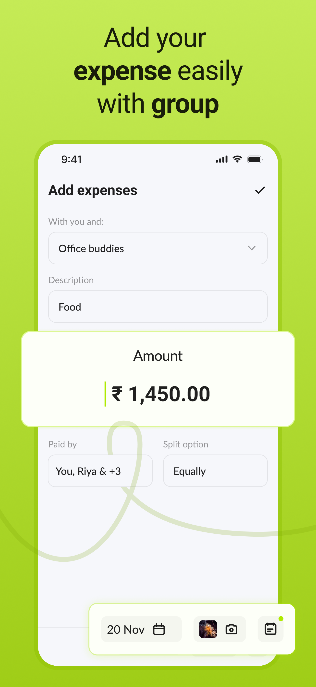
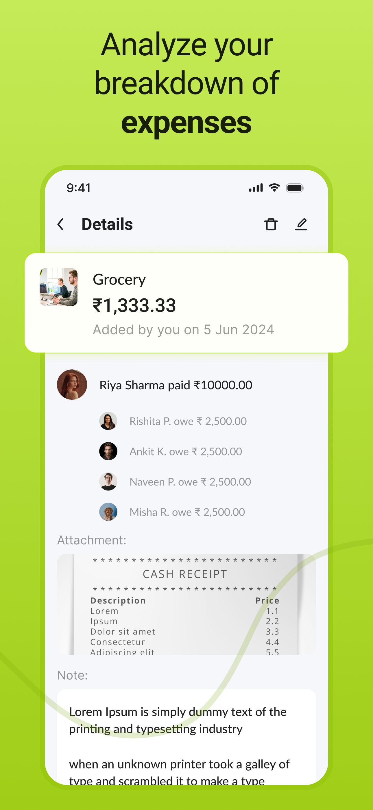
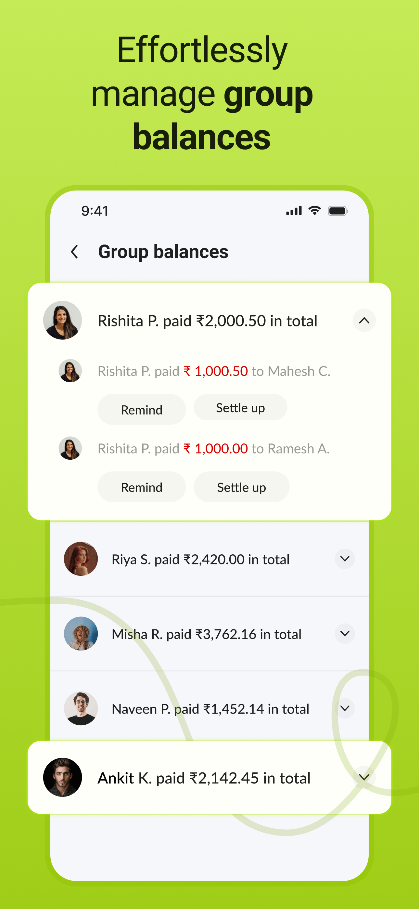
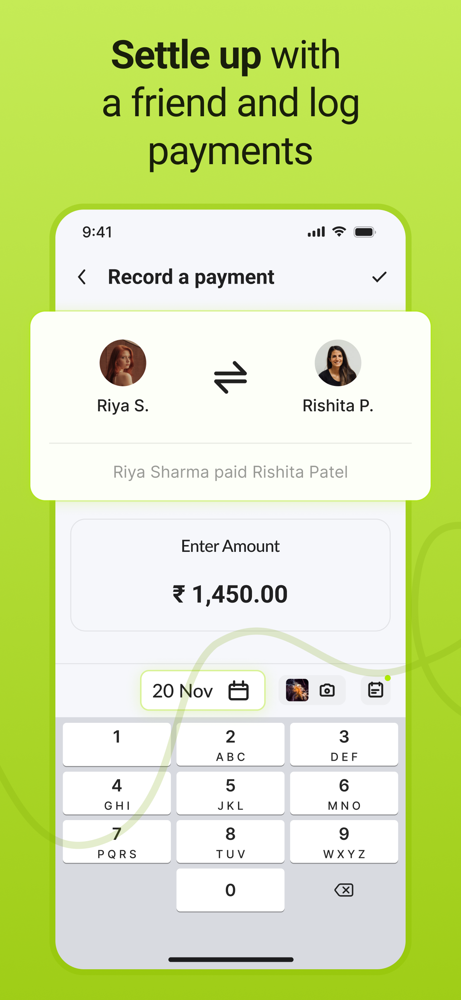
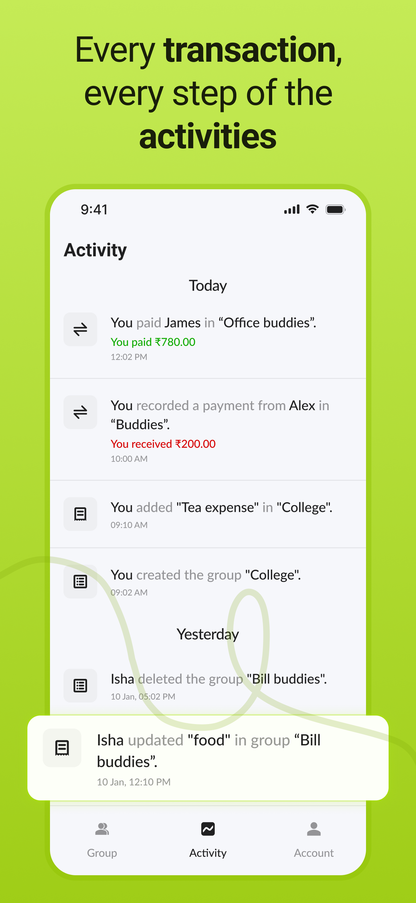

<a href="https://canopas.com/contact"> </a>

# Splito - Divide, Conquer & Enjoy Together! 💰
Simplifying group expense management is easy and fair among friends and family with advanced tracking, splitting, and settlement features.


## Overview

Splito is an open-source expense tracking and splitting application inspired by Splitwise. It simplifies the management of shared expenses 💰, making it easy for users to track 📈, split, and settle costs among friends, family, or group members 👫.

Whether it's a group trip 🌍, shared household bills 🏠, or any other collective expense, Splito ensures fairness and transparency in cost-sharing with its user-friendly interface and robust features. Users can effortlessly manage debts and settle up 💳 payments within their groups 👥.

## Download App 
<a href="https://apps.apple.com/in/app/splito-split-enjoy-together/id6477442217"> </img> </a>

## Features 🌟
- **Group Management:** Create and manage multiple expense groups 👥 for different purposes (e.g., games, trips, shared bills).
- **Expense Tracking:** Add expenses 💰 with relevant details such as description, amount, payer, date, attachments, and notes.
- **Expense Splitting:** Split expenses fairly⚖️ among group members or use customizable ratios for precise cost-sharing.
- **Payment Settlement:** Simplify 💳 payment settlements to clear outstanding balances with group members.
- **Log History:** For complete transparency, Keep track of all past transactions, expenses, and activities within the group.
- **Data Restoration:** Recover accidentally deleted data 🔄 with the restoration feature, ensuring nothing important is lost.
- **Due Payments Reminders:** Get timely notifications 🔔 for unpaid balances to help you stay on top of your financial commitments.

### Upcoming Features 🚧

Splito is currently in active development, with exciting new features planned:

- **Expense Comments:** Add comments 🗨️ to individual expenses for additional context or notes.
- **Custom Filters for Groups:** Apply filters 🔍 to sort and view groups based on specific criteria.
- **Multiple Currency Support:** Handle expenses and payments with multiple currencies 🌍 for seamless international group usage.
- **Expense Categories:** Organize expenses into predefined categories 📂 such as food, travel, or utilities for better clarity.
- **Group Expense Report:** Generate detailed reports 📄 for groups, summarizing spending patterns and balances.
- **Friends List:** Add and manage a list of friends 👯‍♂️ to streamline group creation and expense tracking.
- **Spending Charts:** Visualize spending habits 📊 with intuitive charts for better financial insights.
- **Group Wallet Support:** Introduce a shared group wallet 💼 for easy contribution and expense deduction.
- **Public Contribution Poll:** Allow group members to vote 🗳️ on contributions for events or shared purchases.

<details>
  <summary><b> How to Use Splito </b></summary>

  ## How to Use Splito
  
- Create a Group ➕:
  - Start by creating a new expense group for your specific need (e.g., a trip to Goa, monthly utilities).
- Add Members 👥:
  - Invite friends, family, or colleagues to join the group.
- Track Expenses 📈:
  - Add expenses as they occur, detailing the amount, who paid, and any relevant notes.
- Split Costs⚖️:
  - It uses flexible splitting options to divide expenses fairly among group members.
- Payment Settlements 💳:
  - Settle up the payment with any other group member as any payment occurs.

</details>

## Screenshots
<table>
  <tr>
    <th width="32%"> Group List </th>
    <th width="32%"> Group Expense List </th>
    <th width="32%"> Expense Add/Update </th>
  </tr>
  <tr>
    <td>  </td>
    <td>  </td>
    <td>  </td>
  </tr>  
</table>
<table>
  <tr>
    <th width="32%"> Expense Split Options </th>
    <th width="32%"> Expense Detail </th>
    <th width="32%"> Group Balance </th>
  </tr>
  <tr>
    <td>  </td>
    <td>  </td>
    <td>  </td>
  </tr>  
</table>
<table>
  <tr>
    <th width="32%"> Group Summary </th>
    <th width="32%"> Payment Add/Edit </th>
    <th width="32%"> Payment Details </th>
  </tr>
  <tr>
    <td>  </td>
    <td>  </td>
    <td>  </td>
  </tr>
</table>
<table>
  <tr>
    <th width="32%"> Payment List </th>
    <th width="32%"> Activity Log History </th>
    <th> </th>
  </tr>
  <tr>
    <td>  </td>
    <td>  </td>
    <td> </td>
  </tr>
</table>

## Project Setup ⚙️

Make sure you have the latest stable version of Xcode installed. Then, you can clone this repository to Xcode.

### Notes 📝
- If you're contributing to the project, make sure to create your own Firebase project and follow the steps above to configure the required files.
- Ensure that you update the `GoogleService-Info.plist` and `Secrets.xcconfig` file with your own Firebase project values to build and run the app successfully.
- Sensitive data such as `REVERSE_CLIENT_ID` and other keys are not included in the repository for security purposes.

To clone and run the Splito project locally, please follow these steps:

### 1. Requirements ✅
- **Xcode:** Version 15.4 or higher.
- **iOS:** Version 16.4 or higher.
- **Firebase:** A Firebase project set up in the [Firebase Console](https://console.firebase.google.com).

### 2. Creating the Config Settings File 🛠️
- Create a `Secrets.xcconfig` File.
- Add the following configuration values to a new file named `Secrets.xcconfig` in the Splito directory:

```
// APP INFO
app_name = Splito
app_bundle = com.*****.splito // as per your choice.
app_version_name = 1.0.0
app_version_code = 1000000
```

### 3. Firebase Setup 🚀

- **Create a Firebase Project:**
  - Go to the Firebase Console.
  - Create a new project and configure it with the same bundle ID used in the project.

- **Enable Firebase Services:**
  - Authentication (Phone, Google, and Apple login).
  - Firestore (For storing user data).
 
- **Download `GoogleService-Info.plist`:**
  - After setting up Firebase, download the `GoogleService-Info.plist` file from the Firebase Console.
  - Add this file to the project directory under `Splito/Plist/GoogleService-Info.plist`.

### 4. Configuring Reverse Client ID 🔑

- **Set Up Google Login:**
  - Obtain the `REVERSE_CLIENT_ID` from your Firebase project's Google Sign-In setup.
  - Add this value to the `Secrets.xcconfig` file in the following format:

```
  GOOGLE_REVERSE_CLIENT_ID = com.googleusercontent.apps.************-********.....
```

- **Reference in `Info.plist`:**
  - The project is configured to use environment variables for sensitive data.
  - The `REVERSE_CLIENT_ID` is dynamically added to `Info.plist` during the build process.

### 5. Environment Variable for Deployment 🌐
- The `Secrets.xcconfig` file and `GoogleService-Info.plist` are base64-encoded and stored securely in GitHub secrets for CI/CD purposes.
- During deployment, these files are decoded and added to the project.
- For more detail, you can check this [deployment script](https://github.com/canopas/splito/blob/main/.github/workflows/Deploy.yml).

## Tech stack 📚
Splito utilizes the latest iOS technologies and adheres to industry best practices. Below is the current tech stack used in the development process:
- MVVM Architecture
- SwiftUI
- Concurrency
- Combine + Swift
- Swinject for DI
- SwiftLint for Lint
- Cloud Functions
- Firebase Firestore
- Firebase Authentication
- CocoaLumberjack for Logging

## Contribution 🤝
The Canopas team enthusiastically welcomes contributions and project participation! There are a bunch of things you can do if you want to contribute! The [Contributor Guide](CONTRIBUTING.md) has all the information you need for everything from reporting bugs to contributing entire new features. Please don't hesitate to jump in if you'd like to, or even ask us questions if something isn't clear.

## Credits
Splito is owned and maintained by the [Canopas team](https://canopas.com/). You can follow them on X at [@canopassoftware](https://x.com/canopassoftware) for project updates and releases. If you are interested in building apps or designing products, please let us know. We'd love to hear from you!

<a href="https://canopas.com/contact"></a>

## License 📄

**Splito** is licensed under the Apache License, Version 2.0.

```
Copyright 2024 Canopas Software LLP

Licensed under the Apache License, Version 2.0 (the "License");
You won't be using this file except in compliance with the License.
You may obtain a copy of the License at

   http://www.apache.org/licenses/LICENSE-2.0

Unless required by applicable law or agreed to in writing, software
distributed under the License is distributed on an "AS IS" BASIS,
WITHOUT WARRANTIES OR CONDITIONS OF ANY KIND, either express or implied.
See the License for the specific language governing permissions and
limitations under the License.
```
